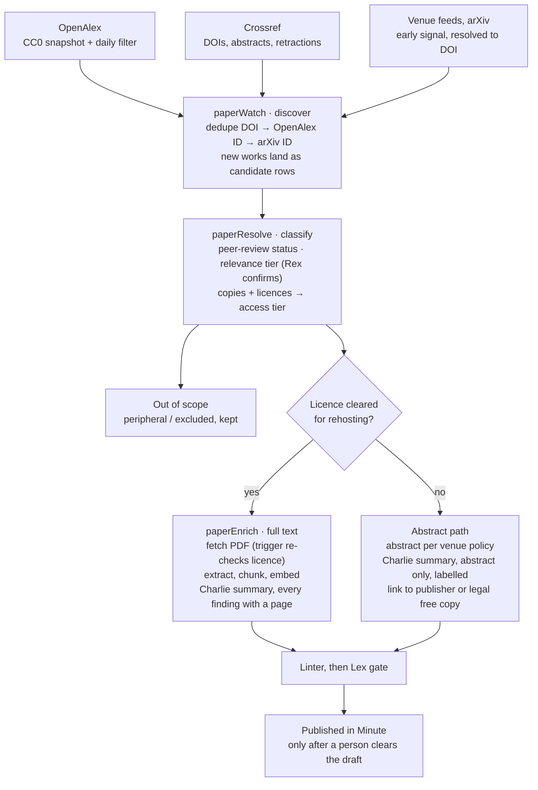

# Feature Spec — Minute Library: Peer-Reviewed Papers

**Status:** Draft · **Author:** Chris Pollard · **Last updated:** 2026-10-10
**Platform:** Minute (`apps/client`) · **Route:** `/library/papers`

## Overview

Papers is a new collection inside the Minute `/library`: the most complete register of peer-reviewed research on bitcoin, with full text and PDF wherever the licence allows rehosting, and abstract plus a canonical source link everywhere else.

It answers one subscriber question: *what does the published evidence actually say?* A CFO building a treasury case, or an SMSF trustee doing diligence, can find the paper behind a claim, read it (or its abstract), see who funded it, and see who has cited it since.

It inherits three load-bearing platform principles:

- **Provenance-first.** Every record carries where its metadata came from, which identifier anchors it, and what licence governs its full text. Absence of an open copy is recorded as a fact, not a gap to paper over.
- **Facts, not conclusions.** Minute states what a paper studied, how, and what it found. It never tells a subscriber what a paper means for their treasury. BTS gives no financial advice, and the library must not become a back door to it.
- **Deterministic before LLM.** Discovery, deduplication, licence resolution and peer-review status are deterministic pipeline steps. Agents only write the plain-English layer, and only on records that already exist.

A second, quieter goal: the same corpus becomes retrieval context for Rex, Margot and Charlie, so internal research stops citing papers from memory.

## Research findings

The corpus is tractable, the metadata is free, and the hard problem is licensing: "free to read" and "free to rehost inside a paid product" are different sets, and the second is much smaller.

### 1. How big is "every peer-reviewed bitcoin paper"?

Thousands, not millions. A Scopus bibliometric study found [4,495 bitcoin documents for 2011–2020](https://elmi.hbku.edu.qa/en/publications/the-ascent-of-bitcoin-bibliometric-analysis-of-bitcoin-research/) across all document types. A 2025 study counted [3,312 Scopus-indexed articles from 2008 to May 2025](https://jurnal.atmaluhur.ac.id/index.php/sisfokom/article/view/2538) using a narrower query. Open indexes like OpenAlex cast a wider net than Scopus, so a working estimate is **8,000–15,000 peer-reviewed works** with bitcoin as a primary subject, growing by low thousands per year.

The number swings by an order of magnitude depending on one decision: does a paper that uses BTC price as one series among twenty count? That is why relevance is tiered (see Scope), not binary.

### 2. The metadata sources

| Source | Role in this feature | Licence of the data | Commercial use in Minute |
| --- | --- | --- | --- |
| [OpenAlex](https://help.openalex.org/data/works/open-access/) | Primary index: works, authors, venues, citations, OA locations, licence per copy, retraction flag | CC0 | Yes. API key now mandatory, $1/day free usage, then [usage-based pricing](https://developers.openalex.org/api-reference/authentication). Full CC0 snapshot on S3 for the backfill |
| [Crossref](https://www.crossref.org/documentation/retrieve-metadata/retraction-watch/) | DOI truth, publisher-deposited abstracts, licence URLs, retractions and corrections (`update-to`, incl. Retraction Watch) | Metadata unrestricted; abstracts may be copyright of publisher or author | Metadata yes; abstracts need the policy in section 4 |
| Unpaywall (now served from OpenAlex data) | OA status colour, `version`, `oa_date` | CC0 | Yes |
| arXiv | Preprint and accepted-manuscript copies; many CS papers live here first | Per-paper licence chosen by author | Only CC-licensed papers may be rehosted (see section 3) |
| [Semantic Scholar](https://api.semanticscholar.org/license) | TLDRs, influential-citation counts | Custom AI2 licence | **No** without a negotiated licence: the default grant is internal, non-commercial research only |
| SSRN | Huge pool of finance working papers | Elsevier terms | Not peer-reviewed; metadata-only links at most. OpenAlex itself [excludes SSRN copies](https://help.openalex.org/data/works/open-access/) because of CAPTCHAs |
| Venue feeds (OJS RSS, conference proceedings pages) | Early detection for key venues before indexes catch up | Varies | Metadata only, resolved back to DOI |

### 3. Licensing: what can actually be rehosted

OpenAlex classifies every copy as diamond, gold, green, hybrid, bronze or closed. Roughly [63% of all works are closed](https://help.openalex.org/data/works/open-access/). Of the open 37%, only part is rehostable in a paid product:

- **CC BY, CC BY-SA, CC0, public domain** — rehost PDF and full text, with attribution and licence notice. Ledger, the field's first dedicated journal, publishes [under CC BY 4.0](https://ledger.pitt.edu/ojs/ledger/announcement/view/28).
- **CC BY-NC / BY-NC-SA / BY-NC-ND** — OpenAlex counts these as "open", but Minute is a paid subscription. Treat as **link-out only** unless counsel signs off that a non-commercial licence permits display inside a paid product. Default: no.
- **CC BY-ND** — rehosting a verbatim PDF is permitted; reflowing text into an HTML reader is arguably fine (format change, not adaptation) but needs the same sign-off.
- **arXiv default licence** — grants rights to arXiv only and [limits reuse by anyone else](https://info.arxiv.org/help/license/). Link out; never cache the PDF for subscribers.
- **Bronze** (free on the publisher site, no licence) — free to read, not free to copy. Link out.
- **Publisher-specific "open" licences** (e.g. Elsevier user licence) — [not redistributable](https://help.openalex.org/data/works/open-access/). Link out.

### 4. Abstracts are not automatically free either

OpenAlex [deliberately ships abstracts as an inverted index](https://docs.openalex.org/api-entities/works/work-object), not plaintext, for legal reasons. The Initiative for Open Abstracts notes that abstracts held by Crossref [may remain under publisher or author copyright](https://web-archive.nli.org.il/National_Library/20181105034639mp_/https://i4oa.org). Displaying the publisher's abstract for a paywalled paper is near-universal practice among indexes, but it is a judgement, not a right. The spec therefore separates the publisher abstract (displayed under a per-publisher policy) from a BTS-written factual summary (always ours, always displayable).

### 5. Peer review is not a field anyone publishes

No index has a reliable `is_peer_reviewed` flag. It has to be inferred from the venue (journal or refereed proceedings), the work type (not `preprint`, not `editorial`), and the version (`publishedVersion` or `acceptedVersion`). Venue quality also needs gating: the field attracts low-quality and predatory journals, so venue reputation is a human-curated attribute, not an automatic one.

## Scope

A paper enters the register if it is peer-reviewed and bitcoin is a substantive subject; how much of it Minute can show is then decided by its licence, not by us.

### In scope

- Peer-reviewed journal articles, refereed conference papers (Financial Cryptography, IEEE S&P, USENIX Security and peers — in computer science, conferences *are* the journals), and refereed book chapters.
- Bitcoin as a primary or substantial subject, in any discipline: finance, accounting, economics, law, computer science, energy.
- All languages in the register; English-first in Minute, with non-English papers shown when an English abstract exists.
- Retractions, corrections and expressions of concern, displayed on the paper.
- Preprints tracked internally so the published version is caught the day it appears.
- A daily watch for new papers and for new venues publishing on bitcoin.

### Out of scope (v1)

- Non-peer-reviewed material: working papers, SSRN, central-bank and industry reports, the whitepaper itself. (See Extended ideas for a clearly labelled "Foundational, not peer-reviewed" shelf.)
- Papers about other cryptoassets or generic blockchain with no substantial bitcoin content.
- Hosting any copy whose licence does not permit redistribution in a paid product.
- Rankings, "best papers" lists or any ordering that implies endorsement.

### Relevance tiers

| Tier | Test | In Minute? | Example |
| --- | --- | --- | --- |
| `core` | Bitcoin is the object of study | Yes | Accounting for bitcoin holdings under IFRS |
| `substantial` | Bitcoin is one of a few compared subjects, with its own findings | Yes | Bitcoin vs gold as a hedge across crises |
| `peripheral` | Bitcoin is one series among many, or a passing mention | No — internal only | ML forecasting benchmark using 30 assets |
| `excluded` | False positive ("bit coin", altcoin-only) | No | — |

Tier is a deterministic first pass (title and abstract term density, venue, topic) confirmed by Rex. A human can override it, and the override is recorded.

### Access tiers

Every paper lands in exactly one access tier, computed from the best licence found across all its copies.

| Access tier | Licence condition | What Minute shows |
| --- | --- | --- |
| `read_here` | CC BY, CC BY-SA, CC0, public domain on any copy (published or accepted version) | Hosted PDF, in-app reader, full-text search, abstract, BTS summary |
| `read_at_source` | Open but not rehostable: CC NC variants (pending counsel), arXiv default, bronze, publisher-specific | Link to the free copy, abstract, BTS summary |
| `abstract_only` | Closed | Abstract (per publisher policy), BTS summary, DOI link, any legal green copy |
| `metadata_only` | Closed and the publisher abstract is not displayable | Title, authors, venue, BTS summary, DOI link |

When a version changes (an embargo lifts and the accepted manuscript appears in a repository under CC BY), the paper moves up a tier automatically and the change is logged.

## Data model

Ten tables, with the licence decision made once in a lookup table and enforced by trigger: no file row can exist for a licence BTS has not approved for rehosting.

| Table | One row per | Key decisions |
| --- | --- | --- |
| `paper_licences` | Licence code (`cc-by`, `cc-by-nc`, `arxiv-default`…) | `rehost_in_paid_product` is a human decision with `decided_by` and `decided_at`; the trigger gate reads it |
| `paper_venues` | Journal, proceedings series or repository | `reputation` is curated (`unreviewed`, `accepted`, `watch`, `rejected`); `abstract_policy` per venue or publisher |
| `papers` | Work, deduplicated on DOI, then OpenAlex ID, then arXiv ID | DOI is never the only key — not every refereed paper has one. Relevance, access tier and status live here |
| `paper_locations` | Copy of a work (publisher page, repository, arXiv) | Licence and version per copy, re-checked on a schedule |
| `paper_files` | Hosted PDF in Supabase Storage | Trigger rejects any licence not approved for rehosting; licence snapshot frozen at retrieval |
| `paper_authors`, `paper_authorships` | Person; person-on-paper | ORCID and OpenAlex author ID; raw affiliation string kept as disclosed |
| `paper_chunks` | Embedded passage | `vector(1536)` to match `voice_snippets`; abstracts and BTS summaries are chunked for every paper, full text only for `read_here` |
| `paper_relations` | Edge between two works | `published_version_of`, `retraction_of`, `correction_of`, `comment_on`, `cites` (internal edges only) |
| `paper_events` | Dated change to a paper | Discovery, tier change, licence change, retraction — provenance and absence-as-fact in one log |
| `paper_watches` | Standing query | OpenAlex filter, venue, author, citation-of, arXiv category; yield stats per watch |

```sql
-- Licence decisions: the single source of truth for what may be rehosted
CREATE TABLE paper_licences (
  code                    TEXT PRIMARY KEY,          -- OpenAlex short code, e.g. 'cc-by'
  name                    TEXT NOT NULL,
  url                     TEXT,
  rehost_in_paid_product  BOOLEAN NOT NULL DEFAULT FALSE,
  allows_adaptation       BOOLEAN NOT NULL DEFAULT FALSE,
  requires_attribution    BOOLEAN NOT NULL DEFAULT TRUE,
  notes                   TEXT,
  decided_by              UUID REFERENCES team_members(id),
  decided_at              TIMESTAMPTZ
);

CREATE TABLE paper_venues (
  id                  UUID PRIMARY KEY DEFAULT gen_random_uuid(),
  openalex_source_id  TEXT UNIQUE,
  issn_l              TEXT,
  issns               TEXT[],
  name                TEXT NOT NULL,
  venue_type          TEXT NOT NULL CHECK (venue_type IN ('journal','conference','book_series','repository','other')),
  publisher           TEXT,
  is_in_doaj          BOOLEAN,
  homepage_url        TEXT,
  feed_url            TEXT,                          -- OJS/RSS for early detection
  reputation          TEXT NOT NULL DEFAULT 'unreviewed'
                      CHECK (reputation IN ('unreviewed','accepted','watch','rejected')),
  reputation_notes    TEXT,
  abstract_policy     TEXT NOT NULL DEFAULT 'display'
                      CHECK (abstract_policy IN ('display','summary_only')),
  first_seen_at       TIMESTAMPTZ NOT NULL DEFAULT NOW(),
  created_at          TIMESTAMPTZ NOT NULL DEFAULT NOW(),
  updated_at          TIMESTAMPTZ NOT NULL DEFAULT NOW()
);

CREATE TABLE papers (
  id                  UUID PRIMARY KEY DEFAULT gen_random_uuid(),
  doi                 TEXT UNIQUE,                   -- lowercased, no URL prefix
  openalex_id         TEXT UNIQUE,
  arxiv_id            TEXT UNIQUE,
  title               TEXT NOT NULL,
  venue_id            UUID REFERENCES paper_venues(id),
  publication_date    DATE,
  publication_year    INT,
  volume TEXT, issue TEXT, pages TEXT,
  language            TEXT,
  work_type           TEXT,                          -- as reported by the index
  peer_review_status  TEXT NOT NULL DEFAULT 'unknown'
                      CHECK (peer_review_status IN ('peer_reviewed','preprint','not_peer_reviewed','unknown')),
  peer_review_basis   TEXT,                          -- e.g. 'venue:journal+version:publishedVersion'
  relevance_tier      TEXT NOT NULL DEFAULT 'unscored'
                      CHECK (relevance_tier IN ('unscored','core','substantial','peripheral','excluded')),
  relevance_basis     JSONB NOT NULL DEFAULT '{}',   -- deterministic scores + Rex verdict + overrides
  access_tier         TEXT NOT NULL DEFAULT 'metadata_only'
                      CHECK (access_tier IN ('read_here','read_at_source','abstract_only','metadata_only')),
  best_licence        TEXT REFERENCES paper_licences(code),
  best_oa_url         TEXT,
  abstract            TEXT,                          -- publisher abstract, verbatim
  abstract_source     TEXT CHECK (abstract_source IN ('crossref','openalex_index','publisher_page','pdf','manual')),
  summary             JSONB,                         -- BTS factual summary: {question, data, method, findings[], limitations[]}
  summary_plain       TEXT,                          -- one-paragraph render of summary, for display and embedding
  curator_note        TEXT,                          -- why this paper matters to a CFO/trustee; first-class for RAG
  topics              TEXT[] NOT NULL DEFAULT '{}',  -- controlled vocabulary
  funders             JSONB NOT NULL DEFAULT '[]',   -- as disclosed: [{name, award_id, source}]
  conflict_disclosure TEXT,                          -- verbatim COI statement where present
  is_retracted        BOOLEAN NOT NULL DEFAULT FALSE,
  cited_by_count      INT,
  cited_by_count_at   TIMESTAMPTZ,
  status              TEXT NOT NULL DEFAULT 'candidate'
                      CHECK (status IN ('candidate','draft','lex_review','published','archived')),
  lex_reviewed_at     TIMESTAMPTZ,
  lex_reviewed_by     UUID REFERENCES team_members(id),
  lex_notes           TEXT,
  discovered_via      UUID,                          -- paper_watches.id
  created_at          TIMESTAMPTZ NOT NULL DEFAULT NOW(),
  updated_at          TIMESTAMPTZ NOT NULL DEFAULT NOW(),
  CONSTRAINT papers_has_identifier CHECK (doi IS NOT NULL OR openalex_id IS NOT NULL OR arxiv_id IS NOT NULL),
  CONSTRAINT papers_published_requires_lex CHECK (
    status <> 'published' OR (lex_reviewed_at IS NOT NULL AND lex_reviewed_by IS NOT NULL
      AND peer_review_status = 'peer_reviewed' AND relevance_tier IN ('core','substantial')))
);

CREATE TABLE paper_locations (
  id               UUID PRIMARY KEY DEFAULT gen_random_uuid(),
  paper_id         UUID NOT NULL REFERENCES papers(id) ON DELETE CASCADE,
  host_type        TEXT NOT NULL CHECK (host_type IN ('publisher','repository','preprint_server')),
  source_name      TEXT,
  landing_url      TEXT,
  pdf_url          TEXT,
  version          TEXT CHECK (version IN ('publishedVersion','acceptedVersion','submittedVersion')),
  licence          TEXT REFERENCES paper_licences(code),
  oa_status        TEXT CHECK (oa_status IN ('diamond','gold','green','hybrid','bronze','closed')),
  is_oa            BOOLEAN NOT NULL DEFAULT FALSE,
  reported_by      TEXT NOT NULL,                    -- 'openalex','crossref','arxiv','manual'
  last_checked_at  TIMESTAMPTZ NOT NULL DEFAULT NOW(),
  UNIQUE (paper_id, landing_url)
);

CREATE TABLE paper_files (
  id               UUID PRIMARY KEY DEFAULT gen_random_uuid(),
  paper_id         UUID NOT NULL REFERENCES papers(id) ON DELETE CASCADE,
  location_id      UUID NOT NULL REFERENCES paper_locations(id),
  licence          TEXT NOT NULL REFERENCES paper_licences(code),   -- frozen at retrieval
  version          TEXT NOT NULL,
  storage_path     TEXT NOT NULL,                    -- bucket 'papers', private
  content_sha256   TEXT NOT NULL,
  byte_size        INT,
  page_count       INT,
  full_text        TEXT,
  extraction_method TEXT,                            -- 'pdf_text','ocr','jats_xml'
  retrieved_at     TIMESTAMPTZ NOT NULL DEFAULT NOW(),
  withdrawn_at     TIMESTAMPTZ,                      -- set if licence decision later reversed
  UNIQUE (paper_id, content_sha256)
);

-- Gate: no file for a licence BTS has not approved for paid-product rehosting
CREATE OR REPLACE FUNCTION enforce_paper_file_licence() RETURNS TRIGGER AS $$
BEGIN
  IF NOT EXISTS (SELECT 1 FROM paper_licences WHERE code = NEW.licence AND rehost_in_paid_product) THEN
    RAISE EXCEPTION 'Licence % is not approved for rehosting in Minute', NEW.licence;
  END IF;
  RETURN NEW;
END; $$ LANGUAGE plpgsql;

CREATE TRIGGER paper_files_licence_gate BEFORE INSERT OR UPDATE OF licence ON paper_files
  FOR EACH ROW EXECUTE FUNCTION enforce_paper_file_licence();

CREATE TABLE paper_chunks (
  id           UUID PRIMARY KEY DEFAULT gen_random_uuid(),
  paper_id     UUID NOT NULL REFERENCES papers(id) ON DELETE CASCADE,
  chunk_kind   TEXT NOT NULL CHECK (chunk_kind IN ('abstract','summary','curator_note','full_text')),
  section      TEXT,                                 -- 'Introduction', 'Results'… when detectable
  page_from    INT, page_to INT,
  chunk_index  INT NOT NULL,
  content      TEXT NOT NULL,
  embedding    vector(1536),
  UNIQUE (paper_id, chunk_kind, chunk_index)
);

CREATE TABLE paper_relations (
  from_paper_id  UUID NOT NULL REFERENCES papers(id) ON DELETE CASCADE,
  to_paper_id    UUID NOT NULL REFERENCES papers(id) ON DELETE CASCADE,
  relation       TEXT NOT NULL CHECK (relation IN ('cites','published_version_of','retraction_of','correction_of','comment_on')),
  source         TEXT NOT NULL,                      -- 'openalex','crossref','retraction-watch','manual'
  PRIMARY KEY (from_paper_id, to_paper_id, relation)
);

CREATE TABLE paper_events (
  id           UUID PRIMARY KEY DEFAULT gen_random_uuid(),
  paper_id     UUID NOT NULL REFERENCES papers(id) ON DELETE CASCADE,
  event_type   TEXT NOT NULL CHECK (event_type IN ('discovered','tier_changed','access_changed','licence_changed',
                 'published_version_found','retracted','corrected','summary_published','file_withdrawn')),
  from_value   TEXT,
  to_value     TEXT,
  source       TEXT NOT NULL,
  occurred_at  TIMESTAMPTZ NOT NULL DEFAULT NOW()
);

CREATE TABLE paper_watches (
  id             UUID PRIMARY KEY DEFAULT gen_random_uuid(),
  name           TEXT NOT NULL,
  watch_type     TEXT NOT NULL CHECK (watch_type IN ('openalex_query','venue','author','cites','arxiv_category','crossref_query')),
  config         JSONB NOT NULL,                     -- e.g. {"filter":"title_and_abstract.search:bitcoin,type:article"}
  is_active      BOOLEAN NOT NULL DEFAULT TRUE,
  last_run_at    TIMESTAMPTZ,
  high_water     TEXT,                               -- last publication/index date seen
  hits_total     INT NOT NULL DEFAULT 0,
  promoted_total INT NOT NULL DEFAULT 0,             -- hits that reached core/substantial: watch yield
  created_at     TIMESTAMPTZ NOT NULL DEFAULT NOW()
);
```

Authors and authorships follow the obvious shape and are omitted here. Indexes on `papers (status, relevance_tier, publication_date DESC)`, a GIN index on `topics`, a trigram index on `title`, and HNSW on `paper_chunks.embedding`.

### Views and access

- `v_minute_papers` — the only object Minute reads. Published, peer-reviewed, `core` or `substantial`, not archived. `abstract` is nulled when the venue's `abstract_policy` is `summary_only`. Exposes `is_retracted` so the UI can never hide it.
- `v_paper_review_queue` — drafts awaiting a human, ordered by relevance then citation velocity.
- `v_new_venues` — venues first seen in the last 90 days with at least one `core` paper: the "new journal" watch.
- `v_licence_audit` — files whose frozen licence no longer has `rehost_in_paid_product = true`, and `read_here` papers with no file.

Every view is created `WITH (security_invoker = true)`, per the repo rule, so it never reads past RLS.

RLS follows the client-library pattern already live: team tables use `is_team_member()`; the subscriber policy on `papers` requires `current_client_account_id() IS NOT NULL AND status = 'published'`. The `papers` storage bucket is private; the reader gets a short-lived signed URL from a route that checks the subscription first.

## Ingestion and watch pipeline

Five Mastra workflows, three of them on the daily path drawn below, deterministic end to end, with agents called only as steps. The licence decision is the fork: it decides whether a paper gets a hosted file or a link.



Everything that reaches the fork has already been deduplicated, classified for peer review and confirmed as relevant; both branches converge on the same Lex gate and human review queue.

| Workflow | Trigger | What it does |
| --- | --- | --- |
| `paperBackfill` | Once, then on demand | Reads the OpenAlex CC0 snapshot from S3, filtered to works with bitcoin in title or abstract. Seeds the register without spending API budget |
| `paperWatch` | Daily 06:00 AEST via a `routines` row | Runs each active `paper_watches` query from its high-water mark; Crossref by index date; venue RSS; arXiv listings. Inserts candidates and a `discovered` event |
| `paperResolve` | Per candidate (`.foreach`, concurrency 5) | OpenAlex singleton lookups (free) plus Crossref for abstract, licence URLs and `update-to`. Computes peer-review status and relevance tier, calls Rex, then writes locations and access tier via a SQL function so the tier is reproducible |
| `paperEnrich` | Per paper reaching `core` or `substantial` | Hosted branch: fetch PDF, hash, upload, insert `paper_files` (trigger re-checks the licence), extract text (reusing the news pipeline's OCR fallback), chunk by section, embed. Both branches: Charlie summary, linter, Lex, status `draft` |
| `paperRecheck` | Weekly | Re-resolves locations for non-hosted papers to catch lifted embargoes; syncs retractions since last run; refreshes citation counts monthly |

Following the Corporate Research decision, there is no interactive suspend: output lands as `draft` rows in the review queue, and promotion to `published` is a human action.

```ts
// Sketch only — check node_modules/@mastra/core/dist/docs before writing the real thing
export const paperResolve = createWorkflow({
  id: 'paper-resolve',
  inputSchema: z.object({ paperId: z.string().uuid() }),
  outputSchema: z.object({ paperId: z.string(), relevanceTier: RelevanceTier, accessTier: AccessTier }),
})
  .then(fetchMetadata)          // OpenAlex singleton (free) + Crossref; no LLM
  .then(classifyPeerReview)     // venue type + work type + version; no LLM
  .then(scoreRelevance)         // term density, venue, topic; no LLM
  .branch([
    [async ({ inputData }) => inputData.band === 'clear_exclude', markExcluded],
    [async ({ inputData }) => inputData.band !== 'clear_exclude', rexConfirmRelevance],
  ])
  .then(resolveAccessTier)      // writes paper_locations, calls compute_access_tier()
  .commit();
```

## Agent integration

No new agent. The pipeline is workflows end to end; existing agents are called as steps where judgement is needed, each returning a Zod-validated structured object, never free prose into a column.

| Agent | Step | Input | Output (schema) | Why an agent, not code |
| --- | --- | --- | --- | --- |
| Rex | Relevance confirmation | Title, abstract, venue, deterministic scores | `{tier, bitcoin_role, topics[], confidence, reasons}` | Distinguishing "bitcoin as subject" from "bitcoin as one series" needs reading |
| Charlie | Factual summary + curator note draft | Full text (`read_here`) or abstract only | `{question, data, method, findings[{claim, locator}], limitations[], basis}` | Compression of a method section is the one thing LLMs are good at |
| Lex | Publish gate | Summary, curator note, linter result | `{verdict, flags[], notes}` | Advice-adjacent and evaluative language detection |
| Simon | Digest and alerts via Signal | `paper_events` since last digest | Message proposal logged to `agent_activity` | Human interface |
| Margot, Bruno, Charlie | Consumers | `searchPapers` tool over `paper_chunks` | Citations with DOI and locator | Stops internal work citing papers from memory |

### Rules that keep the summaries honest

- **Basis is explicit.** `summary.basis` is `full_text` or `abstract_only`. An abstract-only summary may not contain anything the abstract doesn't, and Minute labels it "Summary based on the abstract".
- **Every finding has a locator.** For `read_here` papers, each `findings[]` item carries a page or section reference, so a subscriber can check it in two clicks. A finding without a locator fails validation.
- **Reported, not asserted.** Findings are phrased as what the authors report ("The authors find…", "In their 2014–2021 sample…"), never as facts about bitcoin. A deterministic linter runs before Lex and blocks words like *proves, should, recommend, safe, outperform* outside quotation.
- **No synthesis across papers in v1.** Each summary describes one paper. Cross-paper statements are where advice creeps in; see Extended ideas for how evidence maps can do it safely.
- **Charlie never sees funding data when summarising.** Funders and conflict statements are deterministic fields shown beside the summary, not narrated in it.

### Simon's digest

Weekly on Monday, plus an immediate alert for one event type: a retraction or expression of concern on a `published` paper. That paper may already be cited in a library entry or a subscriber's `/prepare` pack.

```
Papers — week to 4 Oct:
14 new core papers (3 read-here), 9 substantial
1 new venue: Journal of Digital Asset Accounting (2 core papers) — needs reputation review
1 published-version match: Smith & Ng preprint now in J. Corporate Finance
Review queue: 23 drafts
```

## Minute UI

Papers sits at `/library/papers` beside the existing written entries, and its job is to make a paper checkable in under a minute: what it studied, how, what it reported, who paid for it, and where to read it.

### Design stance

The reading room of a good law library, not a search engine. Calm list, generous line height, no thumbnails, no star ratings. Gold appears only as the freshness dot on papers added since the subscriber's last visit, per the platform rule. Years, citation counts and page locators set in JetBrains Mono. Retractions use the destructive colour and are never filtered out of view.

### `/library/papers` — the index

- **Search** is hybrid: keyword over title, authors and venue, plus semantic over abstracts, summaries and full text. A query like *impairment under AASB 138* should find papers that never use the Australian standard's number.
- **Filters** the subscriber chooses: topic, year range, discipline, access ("Read in Minute", "Free at publisher", "Abstract only"), venue. Nothing is filtered or reordered on their behalf.
- **Default order** is newest first. "Most cited" is available as a sort the subscriber picks, labelled as a count, not a quality score.
- **Each row:** title; authors · venue · year; access badge; topic tags; the paper's research question in one line from the summary.
- **Quiet state:** "No new peer-reviewed papers since your last visit. The register was last checked today at 06:00." Never padded with older papers dressed as new.

### `/library/papers/[slug]` — the paper

| Block | Content | Source |
| --- | --- | --- |
| Header | Title, authors (ORCID-linked), venue, date, DOI, licence, peer-review basis | Deterministic |
| Status strip | Retraction or correction notice, if any, above everything else | Crossref / Retraction Watch |
| Summary | Question · Data · Method · Findings (each with a locator chip) · Limitations; labelled with its basis | Charlie, Lex-cleared |
| Why it's here | The curator note: why a CFO or trustee might care, stated without conclusion | Human-edited |
| Abstract | Publisher abstract verbatim with attribution, or omitted under venue policy | Crossref / publisher |
| Read | `read_here`: in-app reader, locator chips scroll to the page. Otherwise a clear "Read at publisher" or "Free copy at arXiv" link | Storage / locations |
| Disclosure | Funders and conflict-of-interest statement as published, or "No funding statement disclosed" | Deterministic |
| Connections | Papers in the register this one cites and is cited by; published version of a preprint; related library entries and Register records | `paper_relations` |
| Actions | Cite in a pack · Copy citation (APA, Harvard, BibTeX) · Download PDF (`read_here` only) | — |

**Cite in a pack** is the commercial point. It reuses the existing `/prepare` action, so a board paper's "evidence" section can carry a formatted citation, the summary's relevant finding with its locator, and the retraction check performed at the moment of citing. A director asking "is there research on this?" gets a footnote, not a vibe.

### Edition copy

| Element | Board Edition | Trustee Edition |
| --- | --- | --- |
| Section intro | Peer-reviewed research on bitcoin, summarised as reported. Read the paper; reach your own view. | Peer-reviewed research on bitcoin, summarised as reported. Useful when documenting what your fund considered. |
| Access badge (hosted) | Read in Minute | Read in Minute |
| Abstract-only label | The publisher's abstract. The full paper is behind the publisher's paywall. | Same |
| Summary footer | A summary of what the authors report, not a view on it. | Same |

## Internal HQ UI

Four screens under `/research/papers` on hq.btreasury.com.au, built for clearing a queue quickly rather than browsing.

- **Review queue** — drafts ordered by relevance tier, then citation velocity. Split view: summary and curator note on the left, source (PDF page or abstract) on the right, locator chips linked between them. Actions: edit, override tier (reason required), send to Lex, archive. Keyboard-first: `j/k` to move, `e` to edit, `l` to send to Lex.
- **Watches** — each standing query with its last run, hits, and yield (hits that became `core` or `substantial`). A watch yielding under 2% for 90 days gets a warning chip: it is costing API credits and reviewer attention for nothing.
- **Venues** — new venues from `v_new_venues` at the top with a reputation decision to make (DOAJ listing, publisher, indexing, editorial board, APC). Rejected venues stay in the table so they are never re-triaged.
- **Licences** — the `paper_licences` table as a decision log: each code, whether it is approved for rehosting, who decided, when, and why. Plus the `v_licence_audit` exceptions.

Corpus health strip across the top: papers by status, share of published papers with a full-text summary, open retraction alerts, and API spend this month against the OpenAlex allowance.

## Extended ideas

The strongest idea here is the sample-period timeline: most contradictions in the bitcoin literature are explained by *when* the data was collected, and showing that is pure fact.

| Idea | What a subscriber gets | Depends on |
| --- | --- | --- |
| **Sample-period timeline** | Every empirical paper on a question drawn as a bar spanning its data window. A director sees at a glance that most "uncorrelated with equities" findings stop before 2020. No verdict, just dates | Structured `summary.data` with start and end dates (add `sample_start`, `sample_end` columns) |
| **Evidence maps** | A question page ("Is bitcoin an inflation hedge?") listing papers grouped by what they report, with counts, sample periods and methods side by side. Grouping is human-curated; Minute never states the answer | Timeline, plus Lex sign-off on the format. Highest advice risk in this list |
| **Rights requests** | Authors usually retain the right to share their accepted manuscript. A workflow drafts a polite request to the corresponding author of high-interest closed papers for permission to host it under CC BY. Each yes moves a paper to `read_here` | Charlie drafts, human sends; permission stored as a `paper_licences` row scoped to that paper |
| **Australian lens** | A filter and shelf for papers on AASB, ASX, ATO, SMSF or Australian data | Topic vocabulary |
| **Register cross-links** | Event studies of a company in the Corporate Research register appear on that company's record, and vice versa | Entity matching on `papers` to `CorporateHoldingsRepository` |
| **Ask the library, with papers** | The existing `library_questions` flow cites paper chunks with page locators, and keeps its no-answer path | `paper_chunks` embeddings |
| **Saved searches** | Subscriber-chosen alerts when a new paper matches their query. Personalisation by their filter, never our suggestion | Notification channel in Minute |
| **Funding transparency view** | Filter by funder type (public grant, industry, none disclosed) — facts as published | `funders` normalised to OpenAlex funder IDs |
| **Foundational, not peer-reviewed** | A separate, clearly labelled shelf for the whitepaper and a handful of canonical technical documents | A one-off editorial list, outside `papers` |
| **Preprint radar** (internal) | Rex sees the frontier six to eighteen months before journals; feeds Margot's strategy work | Already captured by the watch; just a view |

## Build sequence

Five sessions, extending the usual data → ingest → panel pattern with an enrichment session in the middle and the Minute surface last. Session 0 is decisions, not code.

1. **Session 0 — decisions and fixtures.** Counsel view on CC NC licences and on publisher abstracts in a paid product. Seed `paper_licences` from those decisions. Register an OpenAlex API key. Hand-label a golden set of 40 papers covering every relevance tier and access tier; Ledger's back catalogue is the clean `read_here` half.
2. **Session 1 — data layer.** Migrations for all tables, the licence trigger, views, RLS, the private `papers` bucket, and new `routines.action_type` values (`paper_watch`, `paper_resolve`, `paper_licence_recheck`).
   - Acceptance: inserting a `paper_files` row with `cc-by-nc` raises; `v_minute_papers` returns nothing for a `draft`; a subscriber session cannot select `candidate` rows.
3. **Session 2 — discovery and resolution.** `paperBackfill` (OpenAlex S3 snapshot), `paperWatch`, `paperResolve`, deterministic tiering, Rex confirmation, retraction sync.
   - Acceptance: golden set lands with correct relevance tier on at least 36 of 40 and correct access tier on 40 of 40. Access tier is deterministic, so anything less is a bug. Re-running the watch creates zero duplicates.
4. **Session 3 — files and enrichment.** `paperEnrich`: PDF fetch for `read_here`, text extraction, chunking and embedding, Charlie summaries, banned-phrase linter, Lex gate.
   - Acceptance: every finding in a full-text summary carries a locator that resolves to a real page; abstract-only summaries contain no claim absent from the abstract (Mastra scorer over the golden set).
5. **Session 4 — HQ review UI.** Queue, watches, venues, licences, health strip, Simon digest.
6. **Session 5 — Minute.** `/library/papers` index, paper page, in-app reader with signed URLs, Cite in a pack, edition copy.
   - Acceptance: a retracted paper shows its notice above the title on every surface, including inside an existing pack citation.

## Open questions

- [ ] **CC NC in a paid product.** Does a non-commercial licence permit display inside a subscription product if the paper itself is not sold? Default until answered: link out.
- [ ] **Publisher abstracts.** Display verbatim for paywalled papers by default (`abstract_policy = 'display'`), or start at `summary_only` and open up per publisher? Australian fair dealing for research or review may not stretch to a commercial service.
- [ ] **Semantic Scholar.** Worth a commercial licence request for TLDRs and influential-citation counts, or is OpenAlex plus our own summaries enough? Recommendation: skip for v1.
- [ ] **OpenAlex spend.** The backfill should come from the free S3 snapshot; the daily watch should sit well inside the $1/day allowance. Confirm once Session 2 measures real usage.
- [ ] **Edition split.** Do Board and Trustee editions see the same corpus with different default topic filters, or one shared view?
- [ ] **Venue reputation criteria.** Write the rubric before Session 4 so rejections are consistent and explainable if an author asks.
- [ ] **Relevance threshold for "exhaustive".** Is `substantial` in or out of the headline count shown to subscribers?

### Assumptions

- The `/library` route and `client_library_*` tables are live, with RLS on `is_team_member()` and `current_client_account_id()`, and Papers sits beside them rather than inside `client_library_entries`.
- `paper_chunks` uses the same 1536-dimension embedding model as `voice_snippets`.
- Corpus size of 8,000–15,000 is an estimate from Scopus studies; Session 2 replaces it with a measured count.
